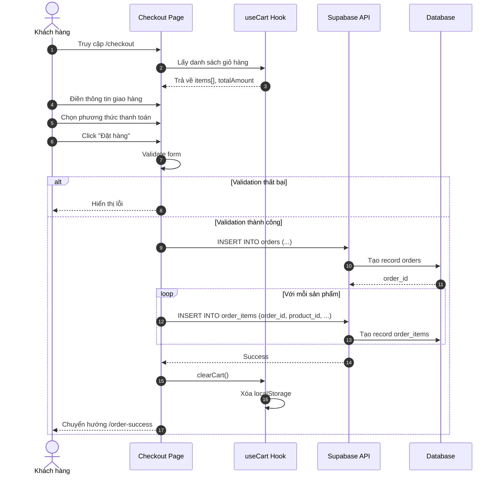
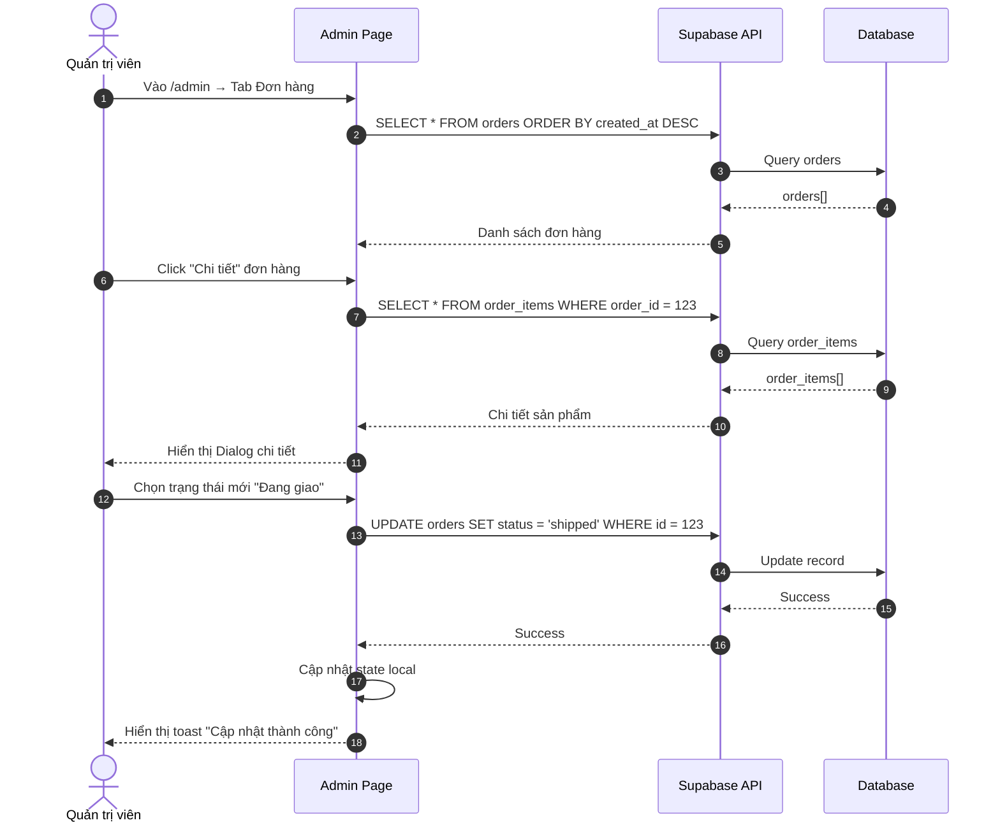
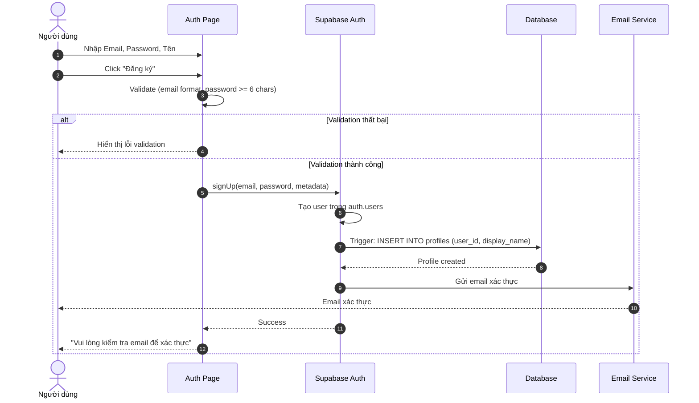
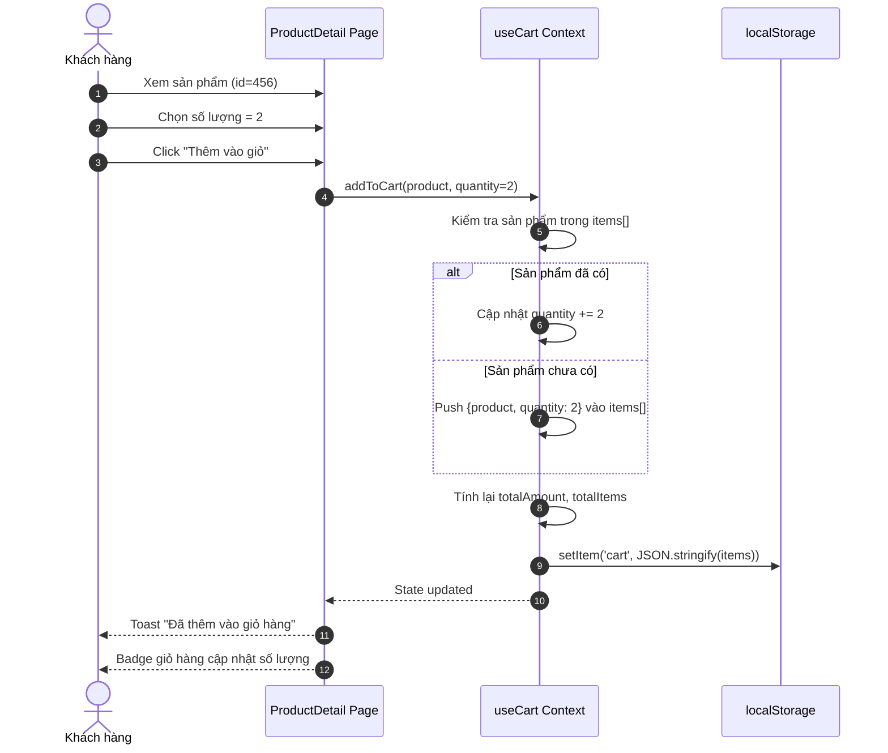

# Bandogo - Website Bán Đồ Gỗ Nội Thất

Dự án website thương mại điện tử chuyên cung cấp các sản phẩm gỗ nội thất, ván công nghiệp và phụ kiện mộc. Website bao gồm đầy đủ các tính năng cho người dùng mua sắm và trang quản trị cho admin.

**Bản chạy thật:** https://bandogo.vercel.app

## 📚 Tài Liệu

| Tài liệu | Nội dung |
|---|---|
| [docs/SETUP.md](docs/SETUP.md) | Cài đặt từ số 0: Supabase, biến môi trường, chạy local, cấp quyền admin, xử lý sự cố |
| [docs/USAGE.md](docs/USAGE.md) | Cách dùng: luồng khách hàng, trang quản trị, tồn kho, những thứ chưa có |
| [docs/DATABASE.md](docs/DATABASE.md) | 14 bảng, RLS, function, storage, cách reset |
| [docs/DEPLOY.md](docs/DEPLOY.md) | Deploy Vercel, kiểm tra sau deploy, lỗi từng gặp |

Chạy nhanh:

```bash
corepack enable
pnpm install
cp .env.example .env      # điền URL + publishable key của Supabase
pnpm dev                  # http://localhost:8080
```

---

## 🚀 Công Nghệ Sử Dụng

- **Frontend:** React (Vite), TypeScript
- **Styling:** Tailwind CSS, Shadcn UI
- **State Management:** React Hooks (Context API cho Cart, Auth)
- **Routing:** React Router DOM
- **Backend & Database:** Supabase (PostgreSQL, Auth, Storage)
- **Icons:** Lucide React
- **Notifications:** Sonner

---

## ✨ Tổng Quan Chức Năng (37 Use Cases)

| ID | Tên Use Case | Actor | Trạng thái |
|----|--------------|-------|------------|
| **A. NHÓM GUEST (KHÁCH VÃNG LAI)** |||
| UC01 | Xem Trang chủ (Landing Page) | Guest | ✅ |
| UC02 | Xem Giới thiệu (About Us) | Guest | ✅ |
| UC03 | Xem Liên hệ & Hotline | Guest | ✅ |
| UC04 | Gửi Form liên hệ | Guest | ✅ |
| UC05 | Xem Danh sách Tin tức | Guest | ✅ |
| UC06 | Xem Chi tiết Tin tức | Guest | ✅ |
| UC07 | Xem Danh sách Dự án | Guest | ✅ |
| UC08 | Tìm kiếm Sản phẩm | Guest | ✅ |
| UC09 | Lọc Sản phẩm (Danh mục) | Guest | ✅ |
| UC10 | Xem Danh sách Sản phẩm | Guest | ✅ |
| UC11 | Xem Chi tiết Sản phẩm | Guest | ✅ |
| **B. NHÓM AUTH (XÁC THỰC)** |||
| UC12 | Đăng ký Tài khoản | Guest | ✅ |
| UC13 | Đăng nhập | Guest | ✅ |
| UC14 | Đăng xuất | User | ✅ |
| **C. NHÓM CUSTOMER (KHÁCH HÀNG)** |||
| UC15 | Thêm vào Giỏ hàng | Customer | ✅ |
| UC16 | Xem Giỏ hàng | Customer | ✅ |
| UC17 | Cập nhật Số lượng Giỏ hàng | Customer | ✅ |
| UC18 | Xóa Sản phẩm khỏi Giỏ | Customer | ✅ |
| UC19 | Thanh toán (Checkout) | Customer | ✅ |
| UC20 | Xác nhận Đặt hàng thành công | Customer | ✅ |
| UC21 | Xem Lịch sử Đơn hàng (`/orders`) | Customer | ✅ |
| UC22 | Cập nhật Hồ sơ Cá nhân (`/profile`) | Customer | ✅ |
| **D. NHÓM ADMIN (QUẢN TRỊ)** |||
| UC23 | Đăng nhập Admin | Admin | ✅ |
| UC24 | Xem Dashboard (Thống kê) | Admin | ✅ |
| UC25 | Xem Danh sách Sản phẩm | Admin | ✅ |
| UC26 | Thêm mới Sản phẩm | Admin | ✅ |
| UC27 | Chỉnh sửa Sản phẩm | Admin | ✅ |
| UC28 | Xóa Sản phẩm | Admin | ✅ |
| UC29 | Quản lý Tin tức (CRUD) | Admin | ✅ |
| UC30 | Quản lý Dự án (CRUD) | Admin | ✅ |
| UC31 | Quản lý Người dùng (Danh sách) | Admin | ✅ |
| UC32 | Xem Danh sách Đơn hàng | Admin | ✅ |
| UC33 | Quản lý Nhập hàng (Import) | Admin | ✅ |
| UC34 | Quản lý Nhà cung cấp | Admin | ✅ |
| UC35 | In Phiếu Nhập Kho | Admin | ✅ |
| UC36 | In Hóa Đơn Bán Hàng | Admin | ✅ |
| UC37 | Cập nhật Trạng thái Đơn hàng | Admin | ✅ |

*(✅ = Đã hiện thực, ⏳ = Đang phát triển)*

---

## 📄 Chi Tiết Luồng Chức Năng

### 1. Người Dùng (Public)

#### Trang Chủ (`/`)
- Hiển thị Banner quảng cáo, Sản phẩm nổi bật, Video quy trình sản xuất.
- Gọi API lấy danh sách sản phẩm từ bảng `products`.

#### Sản Phẩm (`/products`)
- Danh sách sản phẩm với bộ lọc theo danh mục (URL sync).
- **Tìm kiếm**: Nhập từ khóa vào ô Search → Hệ thống query `name LIKE %keyword%`.
- **Lọc Danh mục**: Chọn tab (MFC, MDF, Plywood) → Filter theo `category`.

#### Chi Tiết Sản Phẩm (`/products/:id`)
- Hình ảnh Zoom, Thông số kỹ thuật, Mô tả, Sản phẩm liên quan.

#### Tin Tức (`/news`)
- Cập nhật tin tức thị trường, xu hướng nội thất.

#### Dự Án (`/projects`)
- Showcase các dự án đã thực hiện (hình ảnh, khách hàng, ngày hoàn thành).

#### Giới Thiệu (`/about`) & Liên Hệ (`/contact`)
- Thông tin công ty, form gửi liên hệ.

---

### 2. Xác Thực (Auth)

#### Đăng Ký (`/auth`)
- Validate Email + Password (min 6 chars).
- Tạo user trong Supabase Auth, trigger tạo record trong `public.profiles`.

#### Đăng Nhập (`/auth`)
- Cấp JWT token, lưu phiên đăng nhập.
- Phân quyền Admin nếu `role = 'admin'`.

---

### 3. Giỏ Hàng & Thanh Toán

#### Giỏ Hàng (`/cart`)
- **Logic (`useCart` Context)**:
    - Lưu vào `localStorage` (hoặc DB nếu đã login).
    - Tự động cộng dồn số lượng nếu sản phẩm đã tồn tại.
    - Tính tổng tiền = `Unit Price * Quantity`.

#### Thanh Toán (`/checkout`)
1. Kiểm tra giỏ hàng != rỗng.
2. Điền thông tin giao hàng: Họ tên, Số điện thoại, Địa chỉ nhận.
3. (Tùy chọn) Điền thông tin xuất hóa đơn: Tên công ty, Mã số thuế, Địa chỉ hóa đơn.
4. Chọn phương thức thanh toán (COD / Chuyển khoản).
5. Nhấn "Đặt hàng" → Hệ thống tạo record trong `orders` và `order_items`.
6. Xóa giỏ hàng và chuyển hướng sang `/order-success`.

#### Lịch Sử Đơn Hàng (`/orders`)
- Hiển thị danh sách đơn hàng của khách hàng đã đăng nhập.

#### Hồ Sơ Cá Nhân (`/profile`) - *MỚI*
- Form cập nhật thông tin: Tên hiển thị, SĐT, Địa chỉ.
- Sử dụng `updateProfile` từ `useAuth` hook.

---

### 4. Quản Trị Viên (Admin) - `/admin`

#### Dashboard
- Thống kê: Tổng sản phẩm, Số người dùng, Số đơn hàng, Doanh thu.
- Biểu đồ doanh thu theo thời gian (`RevenueChart`).

#### Quản Lý Sản Phẩm (Tab: Sản phẩm)
- **CRUD**: Thêm, Sửa, Xóa sản phẩm.
- Upload hình ảnh lên Supabase Storage bucket `products`.
- Quản lý giá, tồn kho, trạng thái (Hoạt động/Tạm dừng).

#### Quản Lý Nhập Hàng (Tab: Nhập hàng) - *MỚI*
- **Tạo đơn nhập hàng** từ nhà cung cấp.
- Chọn sản phẩm, số lượng, giá nhập.
- Tự động cập nhật số lượng tồn kho khi hoàn thành đơn nhập.
- **In Phiếu Nhập Kho**: `/print/import/:id` - In phiếu nhập chuẩn với thông tin NCC, danh sách SP, chữ ký.

#### Quản Lý Đơn Hàng (Tab: Đơn hàng)
- Xem danh sách đơn hàng (mới nhất trước).
- Xem chi tiết: Thông tin người mua, sản phẩm, tổng tiền, thông tin xuất hóa đơn.
- **Cập nhật trạng thái đơn hàng** - *MỚI*: Chờ xử lý → Đang xử lý → Đang giao → Đã giao / Đã hủy.
- **In Hóa Đơn Bán Hàng**: `/print/order/:id` - In hóa đơn chuẩn với thông tin khách hàng, danh sách SP.

#### Quản Lý Nhà Cung Cấp (Tab: Nhà cung cấp) - *MỚI*
- **CRUD**: Thêm, Sửa, Xóa nhà cung cấp.
- Thông tin: Tên, Địa chỉ, SĐT, Email.

#### Quản Lý Tin Tức (Tab: Tin tức)
- **CRUD**: Đăng bài viết mới, chỉnh sửa nội dung.
- Bảng `news`: title, content, image_url, created_at.

#### Quản Lý Dự Án (Tab: Dự án)
- **CRUD**: Cập nhật thông tin dự án mới.
- Portfolio các công trình đã thi công (Social Proof).

#### Quản Lý Người Dùng (Tab: Người dùng)
- Xem danh sách người dùng đã đăng ký.
- Phân quyền admin/user.

#### Cài Đặt (Tab: Cài đặt)
- *Đang phát triển*: Thông tin công ty, logo, SEO.

---

## 🗄️ Cấu Trúc Cơ Sở Dữ Liệu (Supabase)

| Bảng | Mô tả |
|------|-------|
| `categories` | Danh mục sản phẩm (Ván MDF, MFC, Gỗ ghép...) |
| `products` | Thông tin sản phẩm, giá, kho, thông số kỹ thuật (JSONB) |
| `news` | Bài viết tin tức |
| `projects` | Thông tin dự án đã thực hiện |
| `orders` | Đơn hàng (Thông tin khách hàng, tổng tiền, trạng thái) |
| `order_items` | Chi tiết sản phẩm trong đơn hàng |
| `profiles` | Thông tin người dùng (liên kết với Supabase Auth) |
| `user_roles` | Phân quyền (`admin` / `user`) |
| `suppliers` | Thông tin nhà cung cấp |
| `import_orders` | Đơn nhập hàng từ NCC |
| `import_order_items` | Chi tiết sản phẩm trong đơn nhập |
| `contracts` | Hợp đồng (schema sẵn, UI chưa nối đủ) |
| `quotes` | Báo giá (schema sẵn, UI chưa nối đủ) |
| `shipments` | Vận đơn (schema sẵn, UI chưa nối đủ) |

Chi tiết cột, RLS policy và function: [docs/DATABASE.md](docs/DATABASE.md).

---

## 🛠️ Hướng Dẫn Cài Đặt

Xem [docs/SETUP.md](docs/SETUP.md) — hướng dẫn đầy đủ từ số 0, kèm mục xử lý sự cố.

---

## 📂 Cấu Trúc Thư Mục

```
src/
├── components/         # Các component tái sử dụng (Header, Footer, UI...)
│   ├── admin/          # Component dành riêng cho trang Admin
│   │   ├── NewsManager.tsx
│   │   ├── ProjectsManager.tsx
│   │   ├── UsersManager.tsx
│   │   ├── ImportManager.tsx
│   │   ├── SuppliersManager.tsx
│   │   └── RevenueChart.tsx
│   └── ui/             # Shadcn UI components
├── hooks/              # Custom hooks (useCart, useAuth, useProducts...)
├── pages/              # Các trang chính
│   ├── Index.tsx       # Trang chủ
│   ├── Products.tsx    # Danh sách sản phẩm
│   ├── ProductDetail.tsx
│   ├── Cart.tsx
│   ├── Checkout.tsx
│   ├── OrderSuccess.tsx
│   ├── MyOrders.tsx    # Lịch sử đơn hàng của khách
│   ├── Admin.tsx       # Trang quản trị
│   ├── Auth.tsx
│   ├── News.tsx
│   ├── Projects.tsx
│   ├── About.tsx
│   ├── Contact.tsx
│   └── print/          # Trang in ấn
│       ├── ImportInvoice.tsx  # In phiếu nhập kho
│       └── OrderInvoice.tsx   # In hóa đơn bán hàng
├── integrations/       # Cấu hình Supabase client
└── App.tsx             # Routing và Layout chính
```

---

## 🔗 Routing

| Path | Component | Mô tả |
|------|-----------|-------|
| `/` | `Index` | Trang chủ |
| `/products` | `Products` | Danh sách sản phẩm |
| `/products/:id` | `ProductDetail` | Chi tiết sản phẩm |
| `/news` | `News` | Tin tức |
| `/projects` | `Projects` | Dự án |
| `/about` | `About` | Giới thiệu |
| `/contact` | `Contact` | Liên hệ |
| `/cart` | `Cart` | Giỏ hàng |
| `/checkout` | `Checkout` | Thanh toán |
| `/order-success` | `OrderSuccess` | Đặt hàng thành công |
| `/orders` | `MyOrders` | Lịch sử đơn hàng |
| `/profile` | `Profile` | Hồ sơ cá nhân |
| `/auth` | `Auth` | Đăng nhập/Đăng ký |
| `/admin` | `Admin` | Trang quản trị |
| `/print/import/:id` | `ImportInvoice` | In phiếu nhập kho |
| `/print/order/:id` | `OrderInvoice` | In hóa đơn bán hàng |

---

## 📊 Biểu Đồ Use Case (Mermaid)

```mermaid
flowchart TB
    subgraph Actors
        Guest((Khách vãng lai))
        Customer((Khách hàng))
        Admin((Quản trị viên))
    end

    subgraph "Public - Xem thông tin"
        UC01[UC01: Xem Trang chủ]
        UC02[UC02: Xem Giới thiệu]
        UC03[UC03: Xem Liên hệ]
        UC04[UC04: Gửi Form liên hệ]
        UC05[UC05: Xem Tin tức]
        UC07[UC07: Xem Dự án]
    end

    subgraph "Products - Sản phẩm"
        UC08[UC08: Tìm kiếm SP]
        UC09[UC09: Lọc SP theo danh mục]
        UC10[UC10: Xem danh sách SP]
        UC11[UC11: Xem chi tiết SP]
    end

    subgraph "Auth - Xác thực"
        UC12[UC12: Đăng ký]
        UC13[UC13: Đăng nhập]
        UC14[UC14: Đăng xuất]
    end

    subgraph "Shopping - Mua hàng"
        UC15[UC15: Thêm vào giỏ]
        UC16[UC16: Xem giỏ hàng]
        UC17[UC17: Cập nhật số lượng]
        UC18[UC18: Xóa SP khỏi giỏ]
        UC19[UC19: Thanh toán]
        UC20[UC20: Xác nhận đặt hàng]
        UC21[UC21: Xem lịch sử đơn]
        UC22[UC22: Cập nhật hồ sơ]
    end

    subgraph "Admin - Quản trị"
        UC24[UC24: Xem Dashboard]
        UC25[UC25: QL Sản phẩm]
        UC29[UC29: QL Tin tức]
        UC30[UC30: QL Dự án]
        UC31[UC31: QL Người dùng]
        UC32[UC32: QL Đơn hàng]
        UC33[UC33: QL Nhập hàng]
        UC34[UC34: QL Nhà cung cấp]
        UC37[UC37: Cập nhật trạng thái ĐH]
    end

    Guest --> UC01 & UC02 & UC03 & UC04 & UC05 & UC07
    Guest --> UC08 & UC09 & UC10 & UC11
    Guest --> UC12 & UC13

    Customer --> UC01 & UC10 & UC11
    Customer --> UC14 & UC15 & UC16 & UC17 & UC18
    Customer --> UC19 & UC20 & UC21 & UC22

    Admin --> UC24 & UC25 & UC29 & UC30
    Admin --> UC31 & UC32 & UC33 & UC34 & UC37
```



---

## 📋 Đặc Tả Chi Tiết Use Case

### UC11: Xem Chi Tiết Sản Phẩm

| Thuộc tính | Mô tả |
|------------|-------|
| **Actor** | Guest, Customer |
| **Mô tả** | Người dùng xem thông tin đầy đủ của một sản phẩm gỗ |
| **Tiền điều kiện** | Sản phẩm tồn tại trong hệ thống |
| **Hậu điều kiện** | Hiển thị chi tiết sản phẩm |

**Luồng chính:**
1. Người dùng click vào sản phẩm từ danh sách
2. Hệ thống gọi API `GET /products/:id`
3. Hệ thống hiển thị: Tên, Giá, Mô tả, Thông số kỹ thuật, Hình ảnh Zoom
4. Hệ thống hiển thị sản phẩm liên quan (cùng category)

**Luồng thay thế:**
- 2a. Sản phẩm không tồn tại → Hiển thị trang 404

---

### UC15: Thêm Sản Phẩm Vào Giỏ Hàng

| Thuộc tính | Mô tả |
|------------|-------|
| **Actor** | Guest, Customer |
| **Mô tả** | Thêm sản phẩm muốn mua vào giỏ hàng tạm |
| **Tiền điều kiện** | Đang ở trang chi tiết sản phẩm |
| **Hậu điều kiện** | Sản phẩm được thêm vào giỏ, badge số lượng cập nhật |

**Luồng chính:**
1. Người dùng chọn số lượng
2. Người dùng click "Thêm vào giỏ"
3. Hệ thống kiểm tra sản phẩm đã có trong giỏ chưa
4. Nếu có → Cộng dồn số lượng
5. Nếu chưa → Thêm mới vào giỏ
6. Hệ thống lưu vào `localStorage`
7. Hiển thị thông báo "Đã thêm vào giỏ hàng"

---

### UC19: Thanh Toán (Checkout)

| Thuộc tính | Mô tả |
|------------|-------|
| **Actor** | Customer (có thể Guest) |
| **Mô tả** | Hoàn tất đặt hàng và thanh toán |
| **Tiền điều kiện** | Giỏ hàng có ít nhất 1 sản phẩm |
| **Hậu điều kiện** | Đơn hàng được tạo, giỏ hàng được xóa |

**Luồng chính:**
1. Người dùng vào trang `/checkout`
2. Hệ thống hiển thị danh sách sản phẩm và tổng tiền
3. Người dùng điền thông tin giao hàng (Họ tên, SĐT, Địa chỉ)
4. (Tùy chọn) Người dùng điền thông tin xuất hóa đơn VAT
5. Người dùng chọn phương thức thanh toán (COD/Chuyển khoản)
6. Người dùng click "Đặt hàng"
7. Hệ thống validate thông tin
8. Hệ thống tạo record trong bảng `orders`
9. Hệ thống tạo records trong bảng `order_items`
10. Hệ thống xóa giỏ hàng
11. Chuyển hướng sang `/order-success`

**Luồng thay thế:**
- 7a. Thông tin không hợp lệ → Hiển thị lỗi validation
- 8a. Lỗi tạo đơn hàng → Hiển thị thông báo lỗi

---

### UC22: Cập Nhật Hồ Sơ Cá Nhân

| Thuộc tính | Mô tả |
|------------|-------|
| **Actor** | Customer |
| **Mô tả** | Cập nhật thông tin cá nhân |
| **Tiền điều kiện** | Đã đăng nhập |
| **Hậu điều kiện** | Thông tin được lưu vào bảng `profiles` |

**Luồng chính:**
1. Người dùng vào `/profile`
2. Hệ thống hiển thị form với dữ liệu hiện tại
3. Người dùng chỉnh sửa: Tên hiển thị, SĐT, Địa chỉ
4. Người dùng click "Lưu thay đổi"
5. Hệ thống gọi `updateProfile()` từ `useAuth`
6. Hệ thống cập nhật bảng `profiles`
7. Hiển thị thông báo "Cập nhật thành công"

---

### UC37: Cập Nhật Trạng Thái Đơn Hàng

| Thuộc tính | Mô tả |
|------------|-------|
| **Actor** | Admin |
| **Mô tả** | Cập nhật trạng thái xử lý đơn hàng |
| **Tiền điều kiện** | Đã đăng nhập với quyền Admin |
| **Hậu điều kiện** | Trạng thái đơn hàng được cập nhật |

**Luồng chính:**
1. Admin vào `/admin` → Tab "Đơn hàng"
2. Admin click "Chi tiết" trên một đơn hàng
3. Hệ thống hiển thị dialog chi tiết
4. Admin chọn trạng thái mới từ dropdown:
   - `pending` → Chờ xử lý
   - `processing` → Đang xử lý
   - `shipped` → Đang giao
   - `delivered` → Đã giao
   - `cancelled` → Đã hủy
5. Hệ thống gọi `UPDATE orders SET status = ?`
6. Hệ thống cập nhật UI
7. Hiển thị thông báo "Cập nhật thành công"

---

## 🔄 Biểu Đồ Tuần Tự (Sequence Diagrams)

### Sequence Diagram: Thanh Toán (Checkout)



### Sequence Diagram: Cập Nhật Trạng Thái Đơn Hàng



### Sequence Diagram: Đăng Ký Tài Khoản



### Sequence Diagram: Thêm Sản Phẩm Vào Giỏ




---

## 🛠️ Cài Đặt & Triển Khai

Đã tách sang thư mục `docs/`:

- **Dựng dự án** → [docs/SETUP.md](docs/SETUP.md)
- **Dùng website & trang admin** → [docs/USAGE.md](docs/USAGE.md)
- **Schema, RLS, storage** → [docs/DATABASE.md](docs/DATABASE.md)
- **Deploy Vercel** → [docs/DEPLOY.md](docs/DEPLOY.md)
